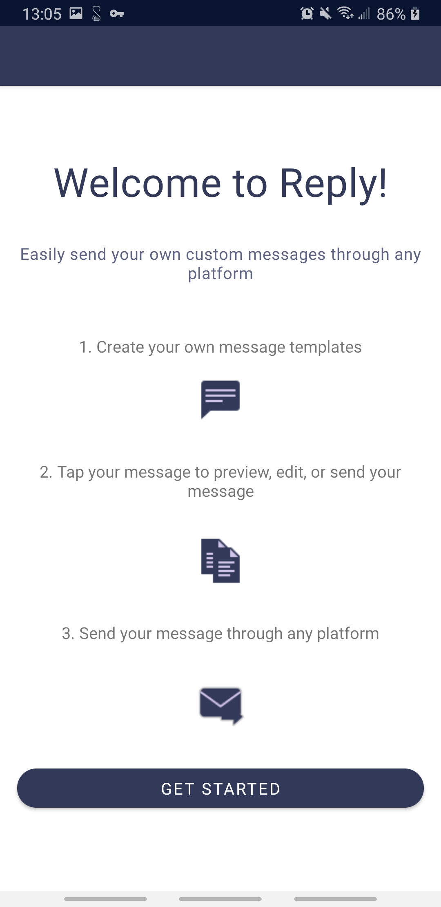

# Reply
Easily send your own custom, pre-defined messages through any platform

## Motivation
I was tired of repeatedly typing the same message over and over, and having to copy and paste the same message to each platform I wanted to post it to. So I created Reply, which makes it easy to send commonly sent messages through any platform.

## Code style
If you're using any code style like xo, standard etc. That will help others while contributing to your project. Ex. -

 
## Screenshots

## Tech/framework used

<b>Built with</b>
- MVVM
- ViewModel
- LiveData
- Navigation Component
- Firebase Authentication
- Cloud Firestore

## Features
- Solves the problem of repeatedly typing commonly sent messages and not being able to send them through multiple platforms

## Code Example
Show what the library does as concisely as possible, developers should be able to figure out **how** your project solves their problem by looking at the code example. Make sure the API you are showing off is obvious, and that your code is short and concise.

## Installation
Provide step by step series of examples and explanations about how to get a development env running.

## API Reference

Depending on the size of the project, if it is small and simple enough the reference docs can be added to the README. For medium size to larger projects it is important to at least provide a link to where the API reference docs live.

## How to use?

## Contribute

## Credits

#### Anything else that seems useful

## License

MIT © [Ashton Jones]()
