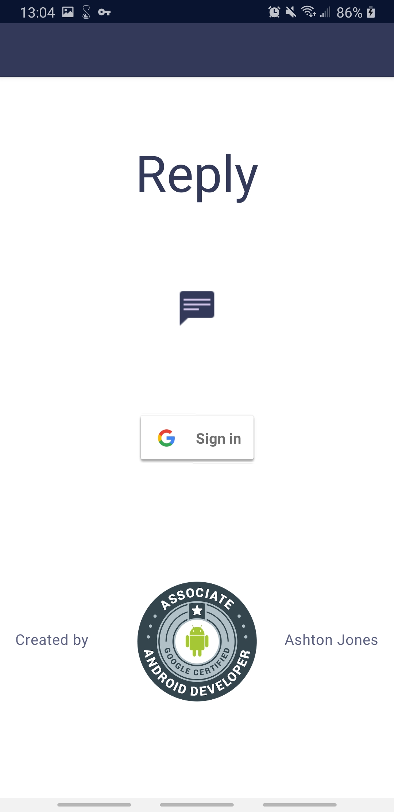
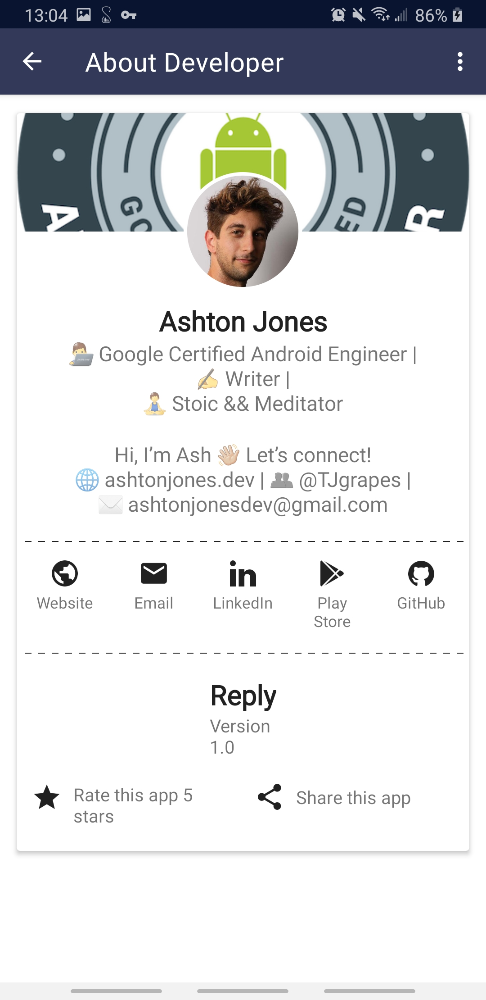
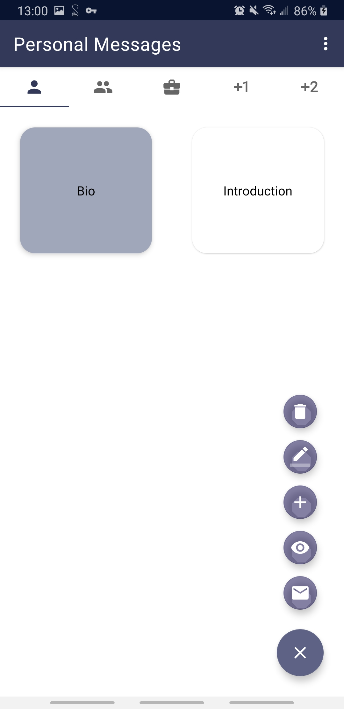
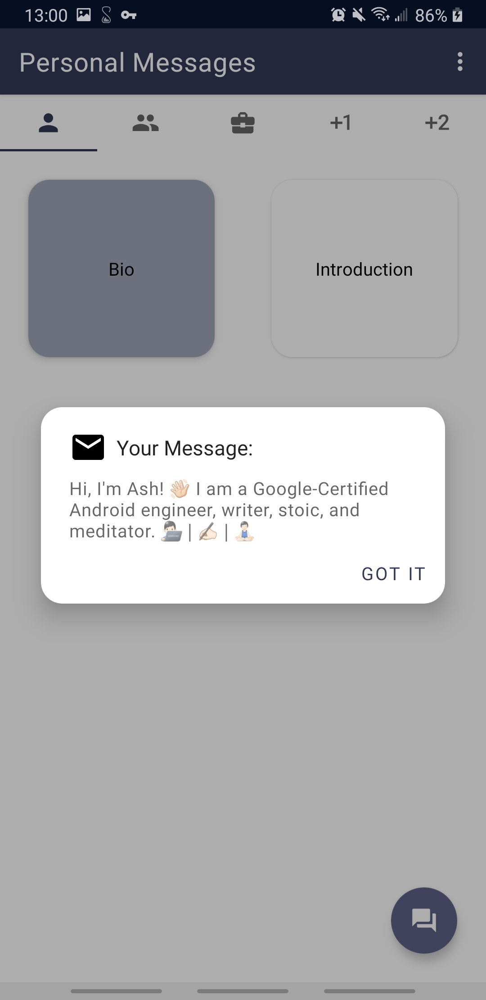
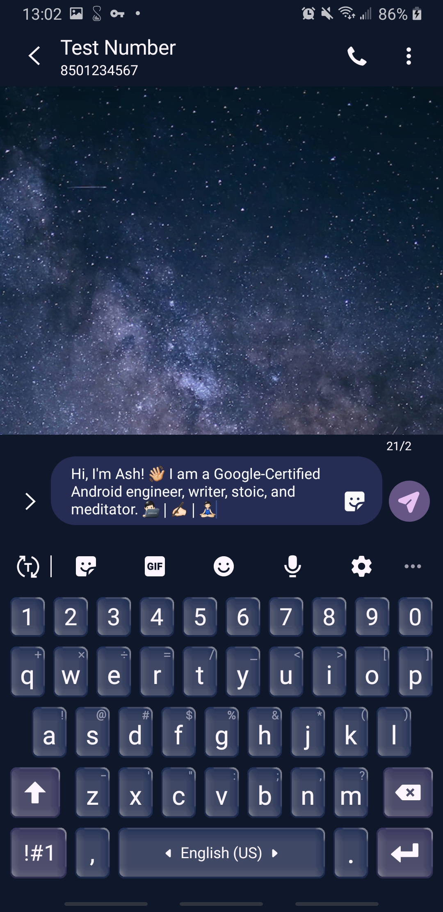
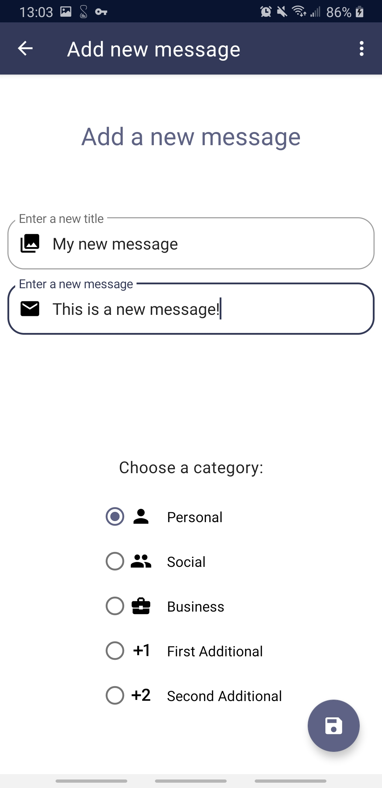
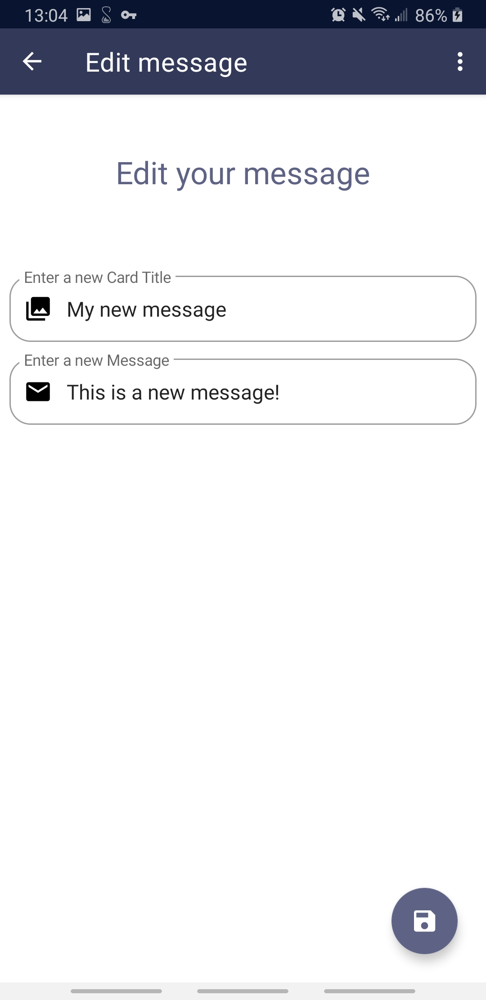
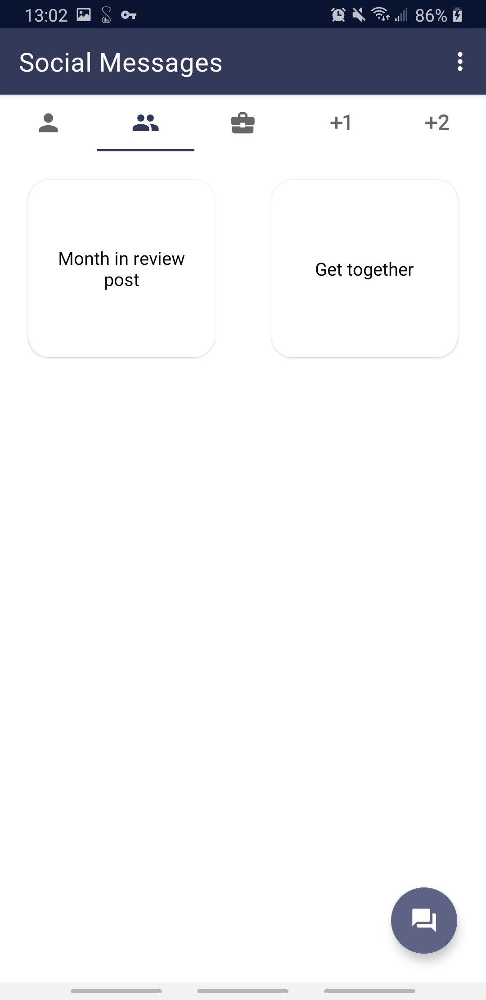
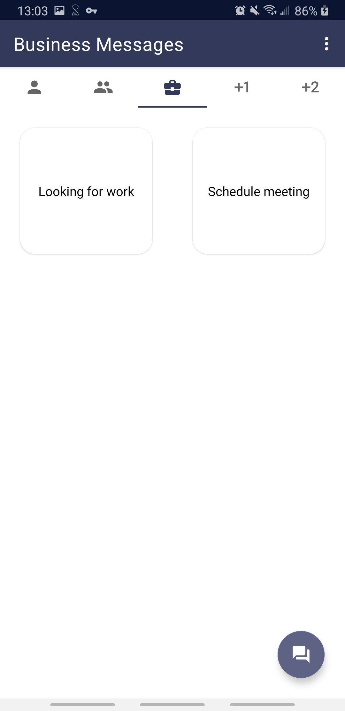
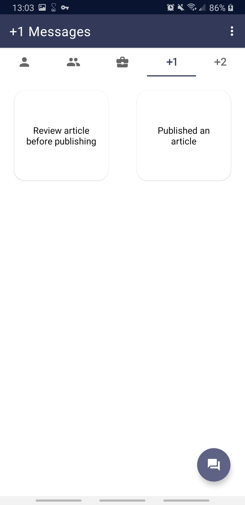

# 📨 Reply

Easily send your own custom, pre-defined messages through any platform
* ✅ Create and store your own message templates 
* ✅ Easily send your messages through any platform
* ✅ Add, edit, and delete your messages
* ✅ Preview and edit your message before you send it
* ✅ Set a timer to remind you to respond with one of your messages at a later time

## 🚀 Motivation
I was tired of repeatedly typing the same message over and over, and having to copy and paste the same message to each platform I wanted to post it to. So I created Reply, which makes it easy to send commonly sent messages through any platform.

## 🕹 Features
- Solves the problem of repeatedly typing commonly sent messages and not being able to send them through multiple platforms
- Uses Android Architecture components, including LiveData, ViewModel, Navigation, and View Binding to make the app robust, stable, and maintainable
- Follows Google's recommended single activity architecture and MVVM design pattern
- Uses Material Design components for a beautiful, consistent design

## 🖥 Technologies used

<b>Built with</b>
- MVVM Architecture
- Java
- [ViewModel](https://developer.android.com/topic/libraries/architecture/viewmodel)
- [LiveData](https://developer.android.com/topic/libraries/architecture/livedata)
- [View Binding](https://developer.android.com/topic/libraries/view-binding)
- [Navigation Component](https://developer.android.com/guide/navigation)
- [Firebase Authentication](https://firebase.google.com/docs/auth)
- [Cloud Firestore](https://firebase.google.com/products/firestore)
- [Material Design](https://material.io/)

## 📚 Libraries used
* [SpeedDialFAB](https://github.com/leinardi/FloatingActionButtonSpeedDial)
* [Multi View Adatper](https://devahamed.github.io/MultiViewAdapter/#/)
* [Material About](https://github.com/jrvansuita/MaterialAbout)

## 👉🏼 Credits
* [Riyaz Ahamed](https://www.linkedin.com/in/devahamed/) for making implementing RecyclerView much easier
* [Roberto Leinardi](https://www.linkedin.com/in/leinardi/) for recreating the awesome FAB from Google Inbox
* [Elijah Danjerfield](https://elijahdangerfield.com/) for writing an incredible [guide to implementing an Android app using MVVM with Firebase](https://medium.com/@elijahdangerfield111/modern-android-development-with-mvvm-livedata-and-firebase-part-1-474d00ab95eb)
* [Evana Margain](http://www.evanamargain.com/) for creating an in-depth [series for connecting an Android app with Firebase using MVVM](https://medium.com/better-programming/using-firestore-with-android-and-architecture-components-cb3b5364027e)

## 👨🏻‍💻 Developed By
[Ashton Jones](https://www.ashtonjones.dev/) 

👨‍💻 Google Certified Android Engineer |
✍ Writer |
🧘‍♂️ Stoic && Meditator
👨🏻‍💻 Ashton Jones
📩 ashtonjonesdev@gmail.com
🌐 www.ashtonjones.dev

Copyright 2020 Ashton Jones

## 📸 Screenshots
&ensp;&ensp;&ensp;
------
&ensp;&ensp;&ensp;
------
&ensp;&ensp;
------
&ensp;&ensp;
------
&ensp;&ensp;&ensp;

